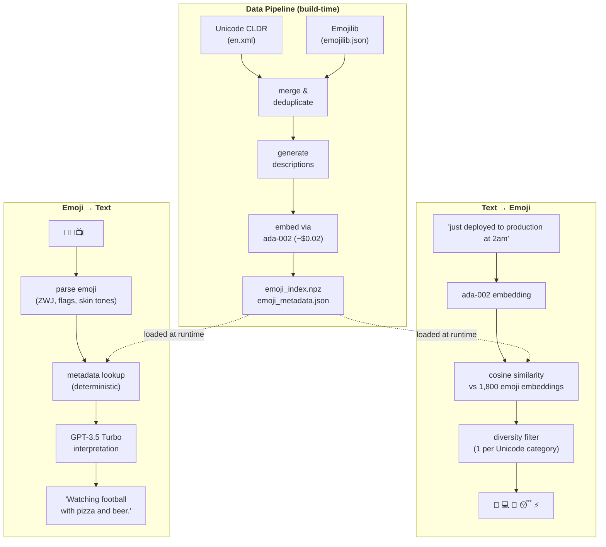

# 🔁 emojify

Bidirectional emoji-text translator powered by embedding-based semantic search. Type a sentence, get the perfect emoji sequence. Paste emoji, get the intended message back.


The core idea: embed both `"I'm so happy right now"` and the description of 😄 (`"grinning face with smiling eyes — happiness, joy, amusement"`) into the same vector space using OpenAI's `text-embedding-ada-002`. Their vectors land close together. That geometric proximity _is_ the mapping — no fine-tuning, no classification head, no prompt engineering.

```
$ emojify suggest "just deployed to production at 2am"
🚀 💻 🌙 😴 ⚡

$ emojify suggest "celebrating my birthday with friends"
🎂 🎉 🥳 🎁 🎈

$ emojify decode "🍕🍺📺🏈"
Individual meanings:
  🍕  pizza — cheese, food, slice
  🍺  beer mug — beer, drink, bar
  📺  television — tv, watch, screen
  🏈  american football — football, sports, nfl

Combined interpretation: "Watching football with pizza and beer."
```

## How It Works

**Text → Emoji:** Your query is embedded via ada-002, then ranked against ~1,800 precomputed emoji description embeddings using cosine similarity. A diversity filter enforces category variety so you don't get five near-identical smiley faces.

**Emoji → Text:** Each emoji is parsed (handling ZWJ sequences, flags, skin-tone modifiers) and looked up in a metadata index. The descriptions are sent to GPT-3.5 Turbo, which generates a single natural-language interpretation.

**Data pipeline:** Unicode CLDR annotations + Emojilib community keywords are merged, deduplicated, and augmented into rich descriptions, then batch-embedded into a `.npz` index (~14MB, loads in <100ms).

## Usage

```bash
# Ranked results with similarity scores
$ emojify text "stuck in traffic and late for work"
┌────────┬──────────┬─────────────────┬──────────────────────────────────┐
│ Emoji  │    Score │ Name            │ Keywords                         │
├────────┼──────────┼─────────────────┼──────────────────────────────────┤
│ 🚗     │     0.87 │ automobile      │ car, vehicle, drive              │
│ 😤     │     0.85 │ face with steam │ frustrated, angry, mad           │
│ ⏰     │     0.84 │ alarm clock     │ time, late, deadline             │
│ 🏢     │     0.82 │ office building │ work, business, corporate        │
│ 😫     │     0.81 │ tired face      │ exhausted, frustrated, fed up    │
└────────┴──────────┴─────────────────┴──────────────────────────────────┘

Suggested sequence: 🚗 ⏰ 😤

# Quick emoji sequence (copy-paste friendly)
$ emojify suggest "pizza and movie night"
🍕 🎬 🍿 🛋️ 🌙

# Decode emoji to text
$ emojify decode "🎓🎉🥂"
Individual meanings:
  🎓  graduation cap — graduation, education, achievement
  🎉  party popper — celebration, congratulations, hooray
  🥂  clinking glasses — cheers, toast, celebration

Combined interpretation: "Congratulations on graduating! Let's celebrate."

# Stage 1 only — no LLM call
$ emojify decode "🔥💪🏋️" --no-llm

# Interactive REPL (auto-detects text vs emoji input)
$ emojify interactive
emojify v0.1.0 — type text or paste emoji (q to quit)

> coding all night to fix a bug
👨‍💻 🐛 🔧 🌙 ☕

> 💔😭🌧️
"Feeling heartbroken and sad."

> q
Goodbye! 👋
```

## Architecture



## Design Decisions

**No vector database.** ~1,800 vectors × 1,536 dimensions = ~14MB in RAM. Brute-force numpy cosine similarity takes <5ms. Pinecone, ChromaDB, or FAISS would add operational complexity with zero performance benefit at this scale. Knowing when a tool isn't needed matters.

**No LangChain.** The entire retrieval pipeline is: embed → dot product → argsort. Three numpy operations. Wrapping this in framework abstractions would obscure the mechanics this project is designed to make visible.

**GPT-3.5 Turbo over GPT-4 for decode.** The decode task is constrained — a handful of emoji descriptions in, one sentence out. GPT-3.5 is 20x cheaper and fast enough for interactive use.

**urllib over the OpenAI SDK for single embeddings.** The `openai` SDK pulls in `httpx` with connection pool threads that complicate process lifecycle in a CLI tool. Single embedding calls go through `urllib` with explicit socket-level timeouts for predictable behavior. The SDK is reserved for batch operations during index building.

**SQLite embedding cache.** Repeated queries skip the API entirely. The cache is a single `cache.sqlite` file with no external dependencies — stdlib only.

**Two-pass diversity filter.** Pass 1 enforces a strict limit of 1 emoji per Unicode category. If that yields fewer results than requested (e.g., querying "sushi" returns mostly Food & Drink), Pass 2 relaxes the constraint and backfills from the next-best matches.

## Tech Stack

| Layer           | Technology              | Why                                                                  |
| --------------- | ----------------------- | -------------------------------------------------------------------- |
| CLI framework   | Click                   | Clean subcommand routing, context passing, testable with `CliRunner` |
| Terminal output | Rich                    | Colored tables, styled text, progress bars                           |
| Embeddings      | text-embedding-ada-002  | Best cost/quality ratio for semantic similarity                      |
| LLM (decode)    | GPT-3.5 Turbo           | Fast, cheap, constrained single-sentence generation                  |
| Vector math     | NumPy                   | Cosine similarity at this scale doesn't need a vector DB             |
| Caching         | SQLite (stdlib)         | Zero-dependency query embedding cache                                |
| Data sources    | Unicode CLDR + Emojilib | Canonical names + community keywords for ~1,800 emoji                |
| Testing         | pytest + pytest-mock    | 76 unit tests, all API calls mocked                                  |

## Project Structure

```
src/emojify/
├── cli.py               # Click CLI (text, suggest, decode, interactive, version)
├── text_to_emoji.py      # Embed query → cosine search → diversity filter
├── decoder.py            # Parse emoji → metadata lookup → GPT-3.5 interpretation
├── diversity.py          # Category-based deduplication (two-pass algorithm)
├── embeddings.py         # OpenAI embedding API calls + SQLite cache
├── index.py              # EmojiIndex: load .npz, cosine similarity search
├── eval.py               # Scoring functions for evaluation suite
└── config.py             # Model constants, data paths, API key loading

data/scripts/             # Four-stage pipeline (fetch → merge → describe → embed)
tests/                    # 76 unit tests + 50-case evaluation suite
```

## Setup

```bash
git clone https://github.com/erinburke/emojify.git
cd emojify
pip install -e ".[dev]"

export OPENAI_API_KEY='your-key-here'

make fetch-data        # Download Unicode CLDR + Emojilib source data
make build-metadata    # Merge sources, generate descriptions
make build-index       # Embed all descriptions via ada-002 (~$0.02)
make test              # Run 76 unit tests
```

## Evaluation

A 50-case test suite scores both pipelines on a 1–3 scale:

- **Text → emoji:** 3 = expected emoji in top 3, 2 = in top 5, 1 = miss
- **Emoji → text:** 3 = cosine similarity to reference > 0.85, 2 = > 0.70, 1 = below

Target: average ≥ 2.3/3.0. Run with `make eval`.
